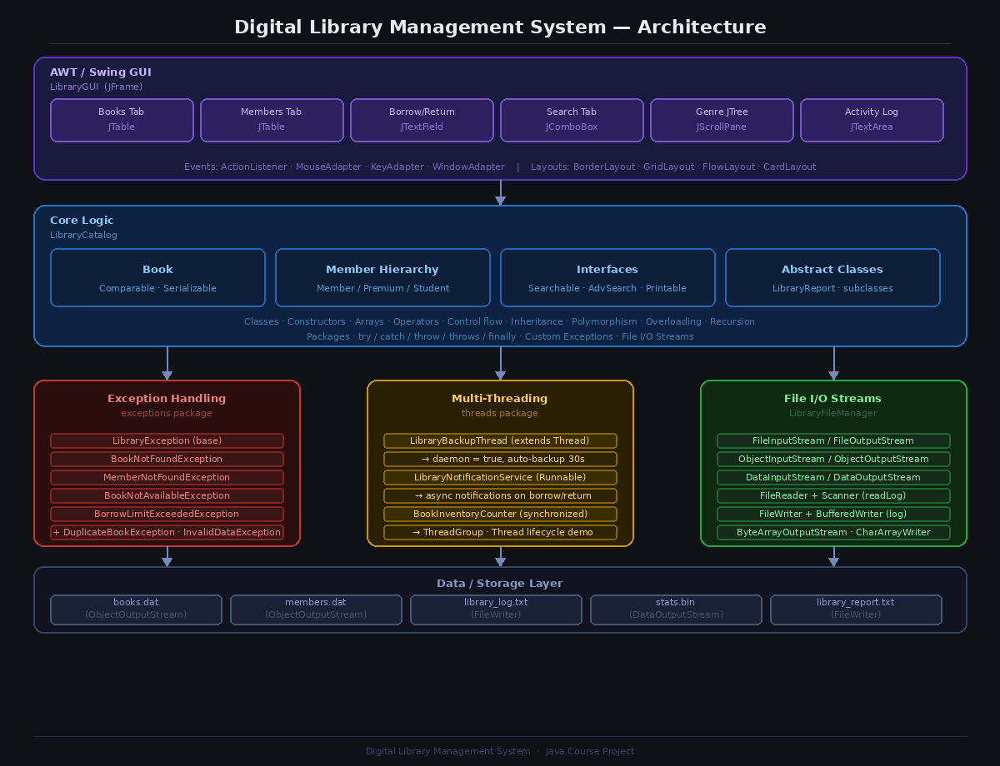

# 📚 Digital Library Management System (Java)

> A fully-featured Java application covering all core Java concepts - **Object-Oriented Programming, Inheritance, Exception Handling, File I/O, Multi-Threading, AWT, and Swing**.

<br>

## 📋 Table of Contents

- [Features](#-features)
- [Tech & Concepts Covered](#-tech--java-concepts-covered)
- [Project Structure](#-project-structure)
- [Architecture](#-architecture)
- [Prerequisites](#-prerequisites)
- [Setup & Run](#-setup--run)
- [Application Flow](#-application-flow)
- [Syllabus Coverage Map](#-syllabus-coverage-map)
- [Sample Data](#-sample-data)
- [Troubleshooting](#-troubleshooting)

<br>

## ✨ Features

| Feature | Description |
|--------|-------------|
| 📖 Book Catalog | Add, remove, rate, and sort books by title |
| 👥 Member Management | Regular, Premium, and Student member types |
| 🔄 Borrow / Return | Full validation — availability, borrow limits, custom exceptions |
| 🔍 Smart Search | Search by title, author, genre, or rating (method overloading) |
| 📁 Genre Browser | JTree-based visual genre navigation |
| 📋 Activity Log | All transactions logged to file with timestamps |
| 💾 Auto-Persistence | Books and members serialized to disk automatically |
| 🔔 Notifications | Async thread-based notifications on every borrow/return |
| 📊 Reports | Text report + binary stats file generated on demand |
| 🌙 Background Backup | Daemon thread auto-saves data every 30 seconds |
| 🖥️ Dual Interface | Full Swing GUI **and** a terminal-based console runner |

<br>

## 🏗 Architecture Overview



<br>

## 🛠 Tech & Java Concepts Covered

OOP Principles, data types, variables, scope, arrays, operators, control statements, classes, objects, constructors, access specifiers, garbage collection |
Inheritance (`super`/sub class), `final`, polymorphism, method overriding, dynamic dispatch, abstract classes, interfaces, extending interfaces, method overloading, recursion, packages |
`try / catch / throw / throws / finally`, built-in + custom exceptions, `FileInputStream`, `FileOutputStream`, `DataInputStream`, `DataOutputStream`, `Scanner`, `FileReader`, `FileWriter`, `ByteArrayOutputStream`, `CharArrayWriter` |
Thread lifecycle, `extends Thread`, `implements Runnable`, `synchronized`, daemon threads, `ThreadGroup`, event handling, mouse/keyboard events, adapter classes, inner classes 
Labels, buttons, text components, checkboxes, radio buttons, combo boxes, menu bar, `BorderLayout`, `GridLayout`, `FlowLayout`, `CardLayout`, MVC architecture |
`JFrame`, `JTabbedPane`, `JScrollPane`, `JTable`, `JTree`, `JTextField`, `JTextArea`, `JButton`, `JCheckBox`, `JRadioButton`, `JComboBox`, `ButtonGroup` |

<br>

## 📁 Project Structure

```
DigitalLibrary/
│
├── src/
│   ├── models/
│   │   ├── Book.java                       
│   │   ├── Member.java                     
│   │   ├── PremiumMember.java              
│   │   └── StudentMember.java              
│   │
│   ├── exceptions/
│   │   ├── LibraryException.java           
│   │   ├── BookNotFoundException.java
│   │   ├── BookNotAvailableException.java
│   │   ├── MemberNotFoundException.java
│   │   ├── BorrowLimitExceededException.java
│   │   ├── DuplicateBookException.java
│   │   └── InvalidDataException.java
│   │
│   ├── main/
│   │   ├── LibraryCatalog.java            
│   │   ├── LibraryFileManager.java         
│   │   ├── LibraryReport.java              
│   │   ├── LibraryInterfaces.java          
│   │   └── LibraryConsoleRunner.java       
│   │
│   ├── threads/
│   │   ├── LibraryThreadManager.java       
│   │   ├── LibraryBackupThread.java        
│   │   ├── LibraryNotificationService.java 
│   │   └── BookInventoryCounter.java       
│   │
│   └── gui/
│       └── LibraryGUI.java                
│
├── data/                                  
│   ├── books.dat                           
│   ├── members.dat                         
│   ├── library_log.txt                     
│   ├── library_report.txt                  
│   └── stats.bin                           
│
├── out/                                    
├── run.sh                                  
└── README.md
```

<br>

## 🏗 Architecture

```
┌─────────────────────────────────────────────────────────────────────┐
│                    LibraryGUI  (JFrame)                             │
│                                                                     │
│  ┌──────────┬───────────┬──────────────┬───────────┬─────────────┐  │
│  │Books Tab │Members Tab│Borrow/Return │Search Tab │Genre JTree  │  │
│  │JTable    │JTable     │JTextField    │JComboBox  │JScrollPane  │  │
│  └──────────┴───────────┴──────────────┴───────────┴─────────────┘  │
│                                                                     │
│  Events : ActionListener · MouseAdapter · KeyAdapter · WindowAdapter│
│  Layouts: BorderLayout · GridLayout · FlowLayout · CardLayout       │
└──────────────────────────────┬──────────────────────────────────────┘
                               │  calls
┌──────────────────────────────▼──────────────────────────────────────┐
│                       LibraryCatalog                                │
│                                                                     │
│  ┌─────────────┬──────────────────┬─────────────┬────────────────┐  │
│  │ Book        │ Member Hierarchy  │ Interfaces  │ Abstract       │  │
│  │ Comparable  │ Member (super)   │ Searchable  │ LibraryReport  │  │
│  │ Serializable│ PremiumMember    │ AdvSearch   │ AvailabilityRpt│  │
│  │             │ StudentMember    │ Printable   │ GenreReport    │  │
│  └─────────────┴──────────────────┴─────────────┴────────────────┘  │
│                                                                     │
│  Classes · Constructors · Arrays · Operators             │
│  Inheritance · Polymorphism · Overloading · Recursion    │
│  try / catch / throw / throws / finally                  │
└───────┬──────────────────────────┬───────────────────────┬──────────┘
        │                          │                       │
┌───────▼────────┐    ┌────────────▼──────────┐    ┌──────▼──────────┐
│ Exceptions     │    │ Multi-Threading       │    │ File I/O Streams│
│                │    │                       │    │                 │
│ LibraryExc     │    │ BackupThread          │    │ FileInputStream │
│ BookNotFound   │    │  (extends Thread)     │    │ FileOutputStream│
│ NotAvailable   │    │  daemon = true        │    │ DataInputStream │
│ MemberNotFound │    │ NotificationService   │    │ DataOutputStream│
│ BorrowLimit    │    │  (implements Runnable)│    │ FileReader      │
│ Duplicate      │    │ InventoryCounter      │    │ FileWriter      │
│ InvalidData    │    │  (synchronized)       │    │ Scanner         │
│                │    │ ThreadGroup           │    │ ByteArrayOutput │
│                │    │ Thread lifecycle demo │    │ CharArrayWriter │
└────────────────┘    └───────────────────────┘    └─────────────────┘
                                   │
┌──────────────────────────────────▼──────────────────────────────────┐
│                        Data / Storage Layer                         │
│                                                                     │
│   books.dat  │  members.dat  │  library_log.txt  │  stats.bin      │
└─────────────────────────────────────────────────────────────────────┘
```

<br>

## ✅ Prerequisites

- **Java JDK 8 or higher** (JDK 17 LTS recommended)
- A terminal / command prompt
- No external libraries required — pure Java

### Check if Java is installed

```bash
java -version
javac -version
```

If you see version numbers, you're good to go. If not, download JDK from:

👉 [https://www.oracle.com/java/technologies/downloads/](https://www.oracle.com/java/technologies/downloads/)

> **Windows users:** During installation, tick ✅ "Add to PATH". Then restart your terminal before continuing.

<br>

## 🚀 Setup & Run

### Step 1 — Clone or extract the project

```bash
# Using Git
git clone https://github.com/YOUR_USERNAME/DigitalLibrary.git
cd DigitalLibrary

# Or extract the ZIP and open a terminal inside the DigitalLibrary folder
```

### Step 2 — Create required folders

```bash
mkdir out
mkdir data
```

### Step 3 — Compile all source files

```bash
javac -d out src/models/*.java src/exceptions/*.java src/main/*.java src/threads/*.java src/gui/*.java
```

No output = compilation succeeded. ✅

### Step 4 — Run

**Option A — Full Swing GUI (recommended)**

```bash
java -cp out gui.LibraryGUI
```

**Option B — Terminal / Console mode (no display needed)**

```bash
java -cp out main.LibraryConsoleRunner
```

### One-shot script (Linux / Mac only)

```bash
chmod +x run.sh
./run.sh
```

<br>

## 🔄 Application Flow

```
START
  │
  ├─► Load saved data (books.dat, members.dat) via ObjectInputStream
  │     └─ No saved data found → seed 12 default books + 4 default members
  │
  ├─► Start daemon BackupThread  (auto-saves every 30 seconds in background)
  │
  ├─► Launch GUI  OR  Console Menu
  │
  └─► USER ACTIONS
        │
        ├─► Add Book
        │     ├─ Validate fields        → throws InvalidDataException  if empty
        │     ├─ Check for duplicate    → throws DuplicateBookException
        │     ├─ Add to list
        │     ├─ Save to books.dat      (ObjectOutputStream)
        │     └─ Log to library_log.txt (FileWriter)
        │
        ├─► Borrow Book
        │     ├─ Find member by ID      → throws MemberNotFoundException
        │     ├─ Find book by ID        → throws BookNotFoundException
        │     ├─ Check borrow limit     → throws BorrowLimitExceededException
        │     ├─ Check availability     → throws BookNotAvailableException
        │     ├─ Decrement available copies
        │     ├─ Add bookId to member's borrowed list
        │     ├─ Increment synchronized InventoryCounter
        │     ├─ Fire async NotificationThread
        │     ├─ Log transaction
        │     └─ Save books.dat + members.dat
        │
        ├─► Return Book
        │     ├─ Find member + book
        │     ├─ Increment available copies
        │     ├─ Remove bookId from member's list
        │     ├─ Increment synchronized InventoryCounter
        │     ├─ Fire async NotificationThread
        │     └─ Save + log
        │
        ├─► Search (4 overloaded search() variants)
        │     ├─ By Title   — partial match
        │     ├─ By Author  — partial match
        │     ├─ By Genre   — partial match
        │     └─ By Rating  — minimum rating filter
        │
        ├─► Generate Report
        │     ├─ Build in-memory via ByteArrayOutputStream + CharArrayWriter
        │     ├─ Save text report  → library_report.txt  (FileWriter)
        │     └─ Save binary stats → stats.bin           (DataOutputStream)
        │
        └─► Exit
              ├─ Save all data
              ├─ Stop BackupThread
              └─ System.exit(0)
```

<br>

| Concept | File | Detail |
|---------|------|--------|
| Classes & Objects | `Book.java`, `Member.java` | Full encapsulation |
| Default Constructor | `Book.java` | `Book()` — auto-increments ID |
| Parameterized Constructor | `Book.java` | `Book(title, author, genre, year, copies)` |
| Access Specifiers | All model classes | `private` fields, `public` methods, `protected` in Member |
| Data types | `Book.java` | `int`, `double`, `boolean`, `String` |
| Arrays | `LibraryCatalog.java` | `String[][]` seed data |
| Control Statements | `LibraryCatalog.java` | `switch`, `if/else`, `for`, `while` |
| Operators & Expressions | Throughout | Arithmetic, logical, relational |
| Type Conversion | `borrowBook()` | `Integer.parseInt()`, `Double.parseDouble()` |
| Scope & Lifetime | All methods | Local vs instance vs static variables |


| Concept | File |
|---------|------|
| Super class | `Member.java` |
| Sub class | `PremiumMember.java`, `StudentMember.java` |
| `super()` constructor call | `PremiumMember.java` |
| `final` class | `StudentMember` declared `final` |
| Method Overriding | `getMemberPrivileges()` in all three Member types |
| Dynamic Method Dispatch | `LibraryCatalog.printAllMemberPrivileges()` |
| Abstract Class | `LibraryReport.java` with `AvailabilityReport`, `GenreReport` |
| Interfaces | `Searchable`, `AdvancedSearch`, `Printable` in `LibraryInterfaces.java` |
| Interface constants | `MAX_SEARCH_RESULTS`, `DEFAULT_SORT` |
| Extending Interfaces | `AdvancedSearch extends Searchable` |
| Method Overloading | `search()` — 3 variants; `searchByTitle()` — 2 variants |
| Recursion | `recursiveTitleSearch()` + `factorial()` in ConsoleRunner |
| Packages | `models`, `exceptions`, `main`, `threads`, `gui` |
| Importing Packages | All files |


| Concept | File | Method |
|---------|------|--------|
| `try / catch / finally` | `LibraryCatalog.java` | `addBook()` |
| `throw` | `LibraryCatalog.java` | `addBook()`, `borrowBook()` |
| `throws` | `LibraryCatalog.java` | All operation method signatures |
| Built-in exceptions | `LibraryGUI.java` | `NumberFormatException`, `IOException` |
| 6 custom exceptions | `exceptions/` package | All 6 classes |
| `FileInputStream` / `FileOutputStream` | `LibraryFileManager.java` | `loadBooks()`, `saveBooks()` |
| `ObjectInputStream` / `ObjectOutputStream` | `LibraryFileManager.java` | Serialization |
| `DataInputStream` / `DataOutputStream` | `LibraryFileManager.java` | `readBinaryReport()`, `writeBinaryReport()` |
| `FileReader` + `Scanner` | `LibraryFileManager.java` | `readLog()` |
| `FileWriter` + `BufferedWriter` | `LibraryFileManager.java` | `logTransaction()`, `saveTextReport()` |
| `ByteArrayOutputStream` | `LibraryFileManager.java` | `generateInMemoryReport()` |
| `CharArrayWriter` | `LibraryFileManager.java` | `generateInMemoryReport()` |


| Concept | File |
|---------|------|
| `extends Thread` | `LibraryBackupThread.java` |
| `implements Runnable` | `LibraryNotificationService.java` |
| Thread lifecycle demo | `LibraryThreadManager.demonstrateThreadLifecycle()` — shows NEW → RUNNABLE → TIMED_WAITING → TERMINATED |
| `synchronized` methods | `BookInventoryCounter.java` — `incrementBorrow()`, `incrementReturn()` |
| Daemon thread | `setDaemon(true)` in `LibraryBackupThread` |
| `ThreadGroup` | `libraryGroup` in `LibraryThreadManager` |
| `thread.join()` | `demonstrateThreadLifecycle()` |
| `ActionListener` | Every button in `LibraryGUI` |
| `MouseAdapter` | Genre tree double-click; button hover |
| `KeyAdapter` | Search field Enter key → trigger search |
| `WindowAdapter` | Window close → confirmation dialog |
| Anonymous inner classes | All event listeners in `LibraryGUI` |


| Control | Location |
|---------|----------|
| `JLabel` | Status bar, stats header, form labels |
| `JButton` | All action buttons with hover colour effect |
| `JTextField` | All form input fields |
| `JTextArea` | Activity log panel |
| `JCheckBox` | "Available Only" filter in search tab |
| `JRadioButton` + `ButtonGroup` | Member type selector |
| `JComboBox` | Genre selector, search type selector |
| `JMenuBar / JMenu / JMenuItem` | File · Tools · Help menus |
| `BorderLayout` | Main frame and all major panels |
| `GridLayout` | All form panels |
| `FlowLayout` | Button panels, search bar |
| `CardLayout` | Declared (`cardLayout`, `cardPanel`) |
| MVC | Data (catalog) → View (tables) → Controller (listeners) |


| Component | Location |
|-----------|----------|
| `JFrame` | `LibraryGUI extends JFrame` |
| `JTabbedPane` | 6-tab main interface |
| `JScrollPane` | Wraps table, tree, log area |
| `JTable` + `DefaultTableModel` | Books tab, Members tab |
| `JTree` + `DefaultMutableTreeNode` | Genre browser tab |
| `JTextField` | All form inputs |
| `JTextArea` | Activity log |
| `JButton` | All action buttons |
| `JCheckBox` | Available-only filter |
| `JRadioButton` | Member type selection |
| `JComboBox` | Genre and search type dropdowns |
| `JOptionPane` | Confirmation dialogs, error messages |
| `SwingUtilities.invokeLater` | Safe Event Dispatch Thread launch |

<br>

## 🗂 Sample Data

The app automatically seeds **12 books** and **4 members** on first run if no saved data exists.

**Default books include:**

| Title | Author | Genre |
|-------|--------|-------|
| Clean Code | Robert C. Martin | Technology |
| The Pragmatic Programmer | David Thomas | Technology |
| Head First Java | Kathy Sierra | Technology |
| 1984 | George Orwell | Dystopian |
| The Great Gatsby | F. Scott Fitzgerald | Fiction |
| Sapiens | Yuval Noah Harari | History |
| A Brief History of Time | Stephen Hawking | Science |
| The Alchemist | Paulo Coelho | Fiction |
| *(+ 4 more)* | | |

**Default members:**

| ID | Name | Type | Max Books |
|----|------|------|-----------|
| 101 | Alice Johnson | Premium | 10 |
| 102 | Bob Smith | Student (MIT) | 5 |
| 103 | Carol White | Regular | 3 |
| 104 | David Lee | Student (IIT) | 5 |

<br>

## 🔧 Troubleshooting

| Problem | Fix |
|---------|-----|
| `javac: command not found` | JDK not installed or not in PATH. Reinstall JDK and restart terminal. |
| `cannot find symbol` errors | Make sure you compile all packages in order — the command above handles this. |
| `No such file or directory` | You're not inside `DigitalLibrary/`. Run `cd DigitalLibrary` first. |
| GUI doesn't open (Linux) | You may need a display server. Use console mode: `java -cp out main.LibraryConsoleRunner` |
| GUI looks blurry (Windows HiDPI) | Right-click `java.exe` → Properties → Compatibility → Override DPI scaling → set to **Application**. |
| Data not saving | Make sure the `data/` folder exists: `mkdir data` |
| `ClassNotFoundException` on load | Delete `data/books.dat` and `data/members.dat`. The app will re-seed fresh data on next run. |

<br>

## 👨‍💻 Author Sanketh Thatikonda

**OOP Thinking · Inheritance · Exception Handling · Multi-Threading · AWT · Swing**

---

## 📄 License

This project is open source and available under the [MIT License](LICENSE).
.
